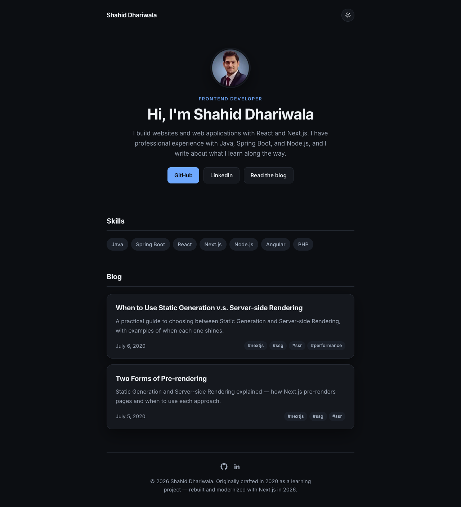

# Next.js Blogging Site

A personal blog and portfolio site built with the modern Next.js App Router. Posts are written in Markdown and statically generated at build time.

Originally crafted in 2020 as a learning project during college — rebuilt and modernized in 2026 with Next.js 16, React 19, a dark/light theme system, and a tag-based content structure.



## Features

- **App Router** with static site generation (SSG)
- **Dark / light theme** toggle with system preference detection (no flash of wrong theme)
- **Markdown-powered posts** with front-matter metadata (title, date, summary, tags)
- **Tag system** with statically generated tag pages (`/tags/[tag]`)
- **Portfolio blocks** — hero/about, skills, and social footer
- Optimized fonts and images via `next/font` and `next/image`

## Tech Stack

| Layer | Technology |
| --- | --- |
| Framework | Next.js 16 (App Router) |
| UI | React 19 |
| Styling | CSS Modules-free global CSS with custom properties (design tokens) |
| Content | Markdown + gray-matter, rendered with unified (remark/rehype) |
| Theming | next-themes |
| Dates | date-fns |

## Getting Started

```bash
npm install
npm run dev
```

Open [http://localhost:3000](http://localhost:3000) in your browser.

## Scripts

| Command | Description |
| --- | --- |
| `npm run dev` | Start the development server |
| `npm run build` | Create an optimized production build |
| `npm start` | Serve the production build |

## Writing a Post

Add a Markdown file to the `posts/` directory:

```markdown
---
title: 'My Post Title'
date: '2026-01-01'
summary: 'One-line description shown on the blog card.'
tags: [nextjs, react]
---

Post content goes here.
```

The post, its card, and any new tag pages are generated automatically at build time.

## Project Structure

```
app/
  layout.jsx          # Root layout: theme provider, top bar, footer
  page.jsx            # Home: hero, skills, blog list
  posts/[id]/page.jsx # Post detail page (SSG)
  tags/[tag]/page.jsx # Posts filtered by tag (SSG)
components/           # Hero, Skills, Footer, PostCard, Tag, Date, ThemeToggle
lib/posts.js          # Markdown parsing and post/tag data helpers
posts/                # Markdown posts
styles/global.css     # Design tokens and global styles
```
